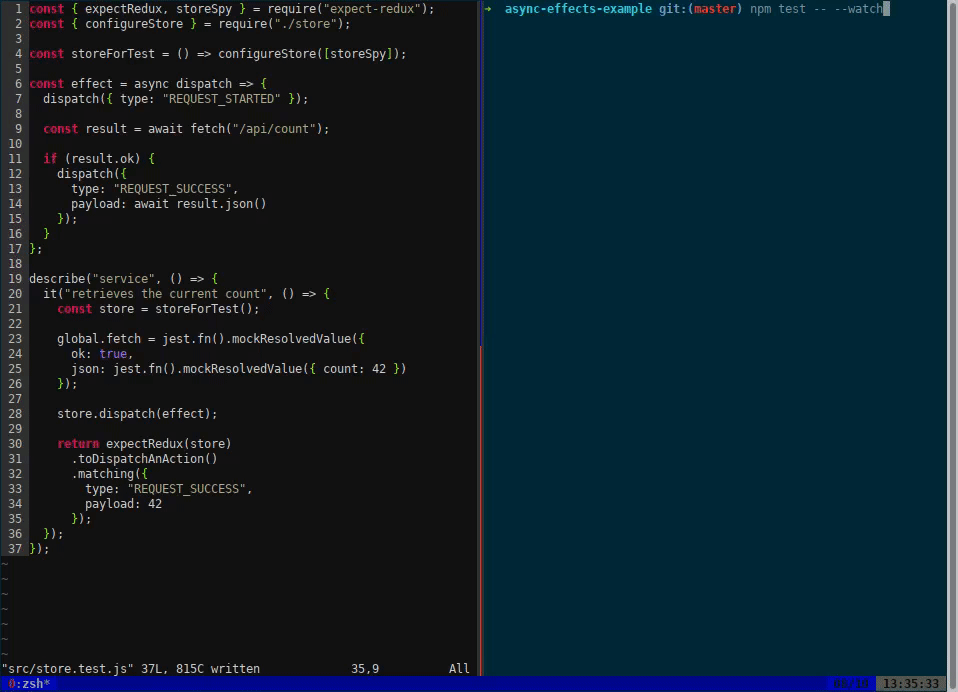

[](https://badge.fury.io/js/expect-redux)

[](https://travis-ci.org/rradczewski/expect-redux)
[](https://david-dm.org/rradczewski/expect-redux) [](https://david-dm.org/rradczewski/expect-redux)

# expect-redux - black box testing for redux

`expect-redux` is a testing library that enables you to write tests that verify the behavior of your business logic, no matter if you are using `redux-saga`, `redux-observable` or just `redux-thunk`. It provides a fluent DSL that makes writing tests with asynchronousness in mind a lot easier.

Here's a simple example to give you an idea:

```js
it("should dispatch SUCCESSFULLY_CALLED on success", () => {
  const store = createStore(...);

  fetch('/some-call-to-an-api')
    .then(() => store.dispatch({ type: "SUCCESSFULLY_CALLED" }))

  return expectRedux(store)
    .toDispatchAnAction()
    .ofType("SUCCESSFULLY_CALLED")
});
```

It doesn't matter if the action is dispatched asynchronously or even if it already was dispatched when you call `expectRedux(store)...`, `expect-redux` records all previously dispatched actions as well as every action that will be dispatched.

See [`/examples`](examples/) for some example projects using different side-effect libraries that are tested with `expect-redux`.

A first version of `expect-redux` was developed for use in our projects at [@VaamoTech](https://twitter.com/VaamoTech) for [Vaamo](https://vaamo.de).

## Installation

```sh
npm install --save-dev expect-redux@next
```

## Usage

`expect-redux` asserts the behavior of your effects, so it's best if you test your store like you would create it in your application code, not in isolation. 

In order to record actions that are dispatched to it, your store only needs to be configured with a spy as an additional `storeEnhancer`:

```js
// store.js
export const configureStore = (extraStoreEnhancers = []) => {
  const storeEnhancers = [
    ,
    /* here goes e.g. applyMiddleware */ ...extraStoreEnhancers
  ];

  const store = createStore(reducer, compose(...storeEnhancers));

  return store;
};
```

With that, just add `storeSpy` from `expect-redux` as an `extraStoreEnhancer` in the setup of your tests:

```js
import { configureStore } from "./store.js";
import { storeSpy } from "expect-redux";

const storeForTest = () => configureStore([storeSpy]);

describe("your test", () => {
  const store = storeForTest();
  // ...
});
```

## API

`expect-redux` supports both test-runners that support waiting for a `Promise` to resolve, such as `jest` or `mocha`, but also (thanks to [`chai-redux`](https://github.com/ScaCap/chai-redux) for the inspiration) supplying a `done` callback to `end(...)` as the last call to every assertion.

```js
it("works if you return a Promise", () => {
  return expectRedux(store)
    .toDispatchAnAction()
    .ofType("PROMISE");
});
```

```js
it("works if you provide a `done` callback", done => {
  expectRedux(store)
    .toDispatchAnAction()
    .ofType("DONE")
    .end(done);
});
```

With the `Promise`-interface, it's easy to write async-await tests with assertions that wait for a certain action to be dispatched:

```js
it("works if you use async-await", async () => {
  // do something...

  await expectRedux(store)
    .toDispatchAnAction()
    .ofType("WAITING FOR THIS");

  // do something else
});
```

### Configuration

#### `expectRedux.configure({ betterErrorMessagesTimeout: number | false })`

Fail if no expectation matched after `timeout` miliseconds. This is a workaround so you get a meaningful error message instead of a timeout error. Can go into the setup file as it's a global switch.



### Assertions on Actions

`expect-redux` is built to assert behavior of side-effects, less the state that results in an action being dispatched. `toDispatchAnAction()` and `toNotDispatchAnAction()` encourage testing the reducer in isolation and instead testing the action producing side-effects.

#### `expectRedux(store).toDispatchAnAction().ofType(type)`

Matches by the passed `type` of an action only

#### `expectRedux(store).toDispatchAnAction().matching(object)`

Matches an action equal to the passed `object` (using [`R.equals`](http://ramdajs.com/docs/#equals))

#### `expectRedux(store).toDispatchAnAction().matching(predicate)`

Matches an action that satisfies the given `predicate`. predicate must be a function `Action => boolean`, e.g. `R.propEq('payload', 'foobar')`. Will not fail if the `predicate` returns `false`.

#### `expectRedux(store).toDispatchAnAction().asserting(assertion)`

Matches an action that won't let the given `assertion` throw an exception. Assertion must be a function `Action => any`, e.g. `action => expect(action.payload).toEqual(42)`. Will not fail if the `assertion` throws.

#### `expectRedux(store).toDispatchAnAction().ofType(type).matching(predicate)`

Matches an action that both is of type `type` and satisfies the given `predicate`. Like above, predicate must be a function `action => boolean`.

#### `expectRedux(store).toDispatchAnAction().ofType(type).asserting(assertion)`

Matches an action that both is of type `type` and does not let the given `assertion` throw. Assertion must be a function `Action => any`, e.g. `action => expect(action.payload).toEqual(42)`. Will not fail if the `assertion` throws.

#### `expectRedux(store).toNotDispatchAnAction(timeout: number)...`

Will negate all following predicates. If an action is dispatched that matches the predicates before `timeout` was reached, the test will fail.

Note that this is a highly dangerous feature, as it relies on the `timeout` to prove that an action was not dispatched. If it takes longer for your side effect to dispatch the action, the test could misleadingly pass even though the action is ultimately dispatched to the store.

### State related assertions

#### `expectRedux(store).toHaveState().matching(expected: Object)`

Will create an assertion that resolves once the store state matches the provided `expected` state.

#### `expectRedux(store).toHaveState().withSubtree(selector: Object => mixed)...`

Will select a subtree of the state before checking the following assertion. For example:

```js
expectRedux(store)
  .toHaveState()
  .withSubtree(state => state.title)
  .matching("Welcome to my website");
```

## Similar or related libraries

- [chai-redux](https://github.com/ScaCap/chai-redux) - a very similar assertion library with a `chai`-like DSL and timing-based assertions (first this action, then that action)
- [redux-action-assertions](https://github.com/dmitry-zaets/redux-actions-assertions)
- [redux-mock-store](https://github.com/arnaudbenard/redux-mock-store)
